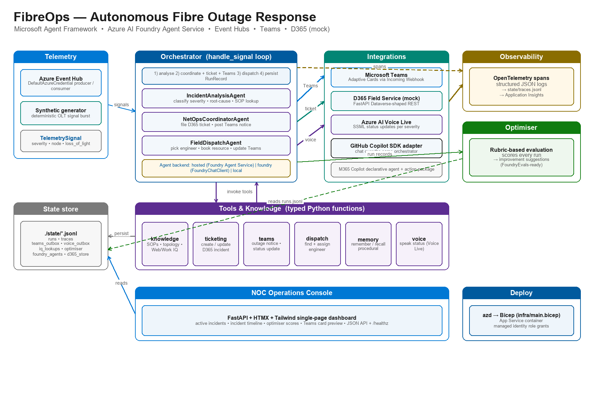
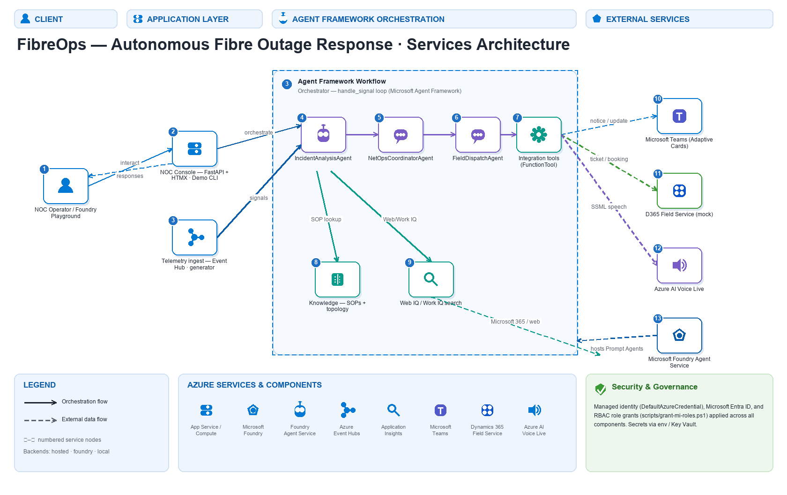
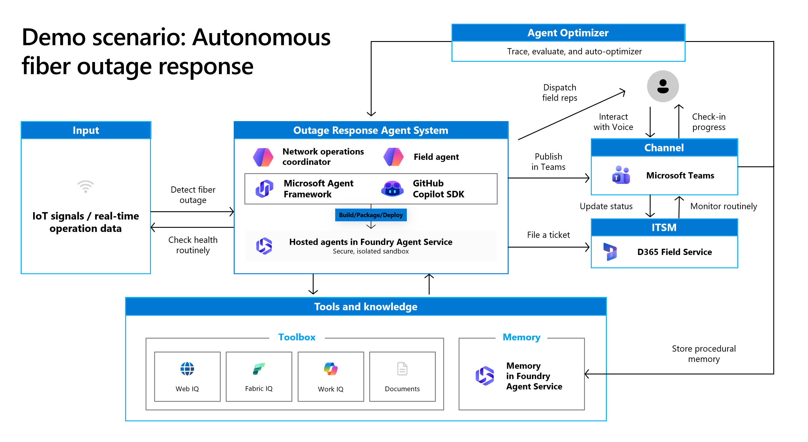
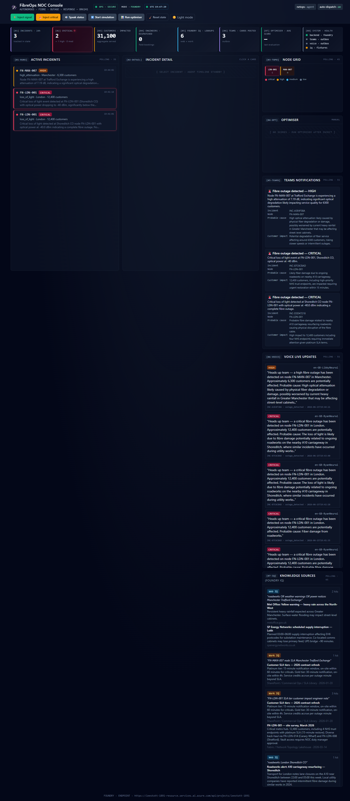
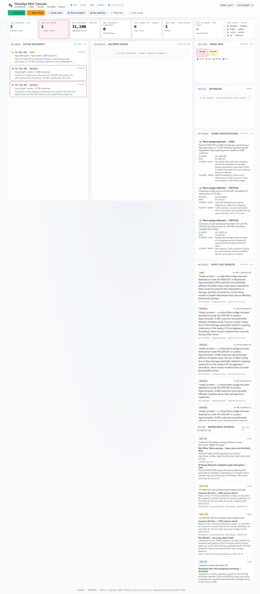
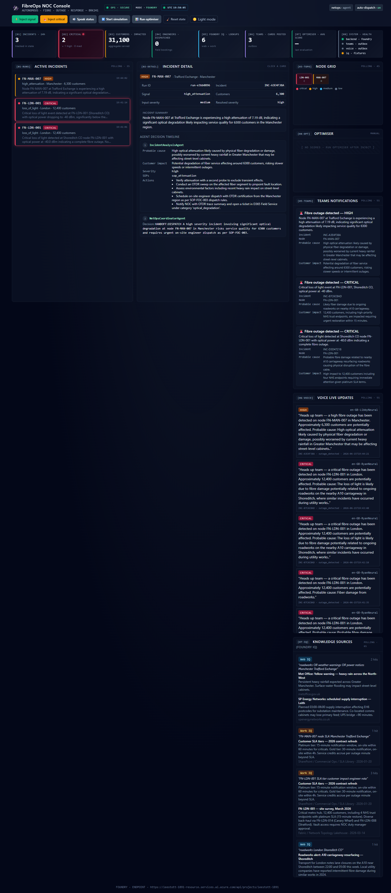

> FibreOps — Autonomous Fibre Outage Response System (BRK241)

> Reference implementation of the **Autonomous Fibre Outage Response** demo
> built on **Microsoft Foundry Agent Service**, the **Microsoft Agent
> Framework**, **Azure Event Hubs**, **Microsoft Teams**, and a **mocked
> Dynamics 365 Field Service** (because most demo tenants don't have D365
> Field Service provisioned).

## Architecture (textual)

```
 OLT telemetry ──▶ Event Hub ──▶ Orchestrator ──┬─▶ IncidentAnalysisAgent
                                                ├─▶ NetOpsCoordinatorAgent ──▶ D365 (mock) + Teams (real)
                                                └─▶ FieldDispatchAgent     ──▶ D365 booking + Teams update
                                                          │
                                                          ▼
                                              OpenTelemetry → Application Insights
                                                          │
                                                          ▼
                                              Optimiser (rubric → suggestions)
```

Agents are **hosted Prompt Agents** in Microsoft Foundry Agent Service
(`agent_framework_foundry.FoundryAgent`). Tools are typed Python functions
the runtime supplies to the hosted definition.

### Architecture diagram



> Regenerate with `python scripts/gen_architecture_diagram.py`
> (writes `docs/images/architecture-diagram.png`).

### Services architecture (swim-lane)

A layered, service-oriented view of FibreOps. Read it left-to-right across four
lanes — **Client → Application Layer → Agent Framework Orchestration →
External Services** — with an Azure services band along the bottom and
managed-identity security/governance applied across every component.



**How to read it.** Solid arrows are the **orchestration flow** (control passing
between FibreOps components); dashed arrows are **external data flow** (calls
that leave the process for an Azure or Microsoft 365 service).

| # | Node | Lane | Role |
| --- | --- | --- | --- |
| ① | NOC Operator / Foundry Playground | Client | Human-in-the-loop driving the demo from the browser, CLI, or Foundry Playground |
| ② | NOC Console (FastAPI + HTMX · Demo CLI) | Application | Entry point — serves the dashboard and exposes the run/optimiser JSON API |
| ③ | Telemetry ingest (Event Hub · generator) | Application | Real Azure Event Hubs consumer **or** the deterministic synthetic OLT signal generator |
| ④ | `IncidentAnalysisAgent` | Orchestration | Classifies severity, finds root cause, pulls the right SOP |
| ⑤ | `NetOpsCoordinatorAgent` | Orchestration | Files the D365 incident and posts the Teams outage notice |
| ⑥ | `FieldDispatchAgent` | Orchestration | Selects the best engineer, books the resource, updates Teams |
| ⑦ | Integration tools (`FunctionTool`) | Orchestration | Typed Python tools the runtime supplies to the hosted agents |
| ⑧ | Knowledge — SOPs + topology | Orchestration | Retrieval over standard operating procedures and the fibre node graph |
| ⑨ | Web IQ / Work IQ search | Orchestration | Grounding against Microsoft 365 / web sources |
| ⑩ | Microsoft Teams | External | Adaptive Card outage notices + status updates via Incoming Webhook |
| ⑪ | Dynamics 365 Field Service (mock) | External | Dataverse-shaped REST for incidents and bookable-resource bookings |
| ⑫ | Azure AI Voice Live | External | SSML status announcements, voice/prosody chosen per severity |
| ⑬ | Microsoft Foundry Agent Service | External | Hosts the published Prompt Agents that back ④–⑥ |

**End-to-end flow.** A telemetry signal arrives at ③ (Event Hub or generator)
and the **Orchestrator** (`handle_signal`, lane 3) drives it through the agent
pipeline ④ → ⑤ → ⑥. Each agent calls the typed tools ⑦–⑨ — SOP/topology
lookups and Web/Work IQ grounding — then fans out to the external services:
ticket and booking to **D365** ⑪, Adaptive Cards to **Microsoft Teams** ⑩, and
spoken updates through **Azure AI Voice Live** ⑫. The agents themselves are
hosted Prompt Agents in **Microsoft Foundry Agent Service** ⑬. The operator ①
sees everything live in the NOC Console ②.

> Regenerate with `python scripts/gen_services_architecture.py`
> (writes `docs/images/services-architecture.png`).

## Capabilities

- 📡 **Telemetry** — synthetic IoT signal generator + real Azure Event Hubs
  producer/consumer with `DefaultAzureCredential`.
- 🧠 **Agent system** — three role-specialised agents (Incident Analysis,
  NetOps Coordinator, Field Dispatch). Three pluggable backends share one
  `.run()` contract:
  - **`hosted`** — `agent_framework_foundry.FoundryAgent` connected to a
    Prompt Agent published to **Microsoft Foundry Agent Service** (the
    architecture-diagram path).
  - **`foundry`** — `agent_framework.Agent` + `FoundryChatClient` with the
    definition resolved locally (useful while iterating on prompts).
  - **`local`** — deterministic `LocalAgent` so the demo runs without any
    Azure credentials.
- 🛠️ **Tools** — knowledge (SOPs + topology), D365 ticketing (Dataverse-shaped
  REST), Microsoft Teams Adaptive Cards, engineer dispatch, procedural memory.
- 📨 **Teams** — Adaptive Card outage notices + status updates via Incoming
  Webhook (any unconfigured channel is logged to `state/teams_outbox.jsonl`).
- 🎟️ **D365 mock** — FastAPI service mimicking `/api/data/v9.2/incidents` and
  `/api/data/v9.2/bookableresourcebookings`. Swap `D365_MOCK_BASE_URL` to a
  real Dataverse environment with no code changes.
- 🔭 **Observability** — JSON structured logs + OpenTelemetry spans persisted
  to `state/traces.jsonl`. Set `APPLICATIONINSIGHTS_CONNECTION_STRING` to
  ship to Application Insights.
- 🔁 **Optimiser** — rubric-based evaluation of every run + actionable
  improvement suggestions. Folds in Foundry cloud Evaluators
  (`evaluate_traces`) when `FIBREOPS_FOUNDRY_EVALS=1`, else local rubric only.
- 📦 **Containerised hosted agent** — the whole analyse → coordinate →
  dispatch flow packaged as a single **hosted agent in Foundry Agent Service**
  (V1Preview). `src/fibreops/agents/hosted_app.py` serves the OpenAI
  `/responses` contract on port 8088; `agent.yaml` +
  `src/fibreops/agents/Dockerfile.hosted` declare the image, sandbox size, and
  protocol; `python -m fibreops.demo deploy-hosted` registers it. See
  [Deploy the containerised hosted agent](#deploy-the-containerised-hosted-agent).

  

## NOC console preview

The deployed application is a tactical Network Operations Center wallboard
with a live KPI strip, node topology grid, severity LEDs, alarm pulses,
panel codes (`[01·RUNS]`, `[02·DETAIL]`, …), live UTC clock, and a
light/dark theme toggle. All numbers are aggregated from real run state —
nothing is fabricated.

| Dark mode (default NOC look)                              | Light mode                                                   |
| --------------------------------------------------------- | ------------------------------------------------------------ |
|          |           |

Run detail with a real Foundry agent decision (Incident Analysis →
NetOps Coordinator handing off to dispatch):



## Quick start

```powershell
# 1. Create venv & install
python -m venv .venv
.\.venv\Scripts\python.exe -m pip install -r requirements.txt
.\.venv\Scripts\python.exe -m pip install -e .

# 2. (Optional) configure real services
Copy-Item .env.example .env
# edit .env -> set AZURE_AI_PROJECT_ENDPOINT, TEAMS_WEBHOOK_URL, EVENT_HUB_FQDN
az login        # for Foundry + Event Hub via DefaultAzureCredential

# 3. (Optional) publish hosted Prompt Agents to Foundry — one-time
.\.venv\Scripts\python.exe -m fibreops.demo publish

# 4. Run the demo
.\.venv\Scripts\python.exe -m fibreops.demo --signals 3
```

### Demo CLI

| Command                                          | Purpose                                                            |
| ------------------------------------------------ | ------------------------------------------------------------------ |
| `python -m fibreops.demo` _(or)_ `... run`       | Run the full end-to-end demo (default 3 signals)                   |
| `python -m fibreops.demo --signals N`            | Inject N telemetry signals                                         |
| `python -m fibreops.demo run --publish-eh`       | Publish signals to a real Event Hub before consuming               |
| `python -m fibreops.demo run --backend local`    | Force the deterministic local backend (offline-safe)               |
| `python -m fibreops.demo publish`                | Create the three hosted Prompt Agents in Foundry                   |
| `python -m fibreops.demo cleanup`                | Delete the hosted Prompt Agents                                    |
| `python -m fibreops.demo serve-hosted`           | Run the containerised hosted-agent entrypoint locally (`/responses` on 8088) |
| `python -m fibreops.demo deploy-hosted`          | Register the containerised hosted agent in Foundry Agent Service   |
| `python -m fibreops.demo backend`                | Show which backend the current config will resolve to              |
| `python -m fibreops.demo card`                   | Render the latest Teams Adaptive Card payload from the outbox      |
| `python -m fibreops.demo chat "status"`          | Talk to FibreOps via the **GitHub Copilot SDK adapter** (slide 4)  |
| `python -m fibreops.demo publish-m365`           | Build the **Microsoft 365 Copilot declarative agent + action package** (slide 13) |

### Agent backend resolution

Set `FIBREOPS_AGENT_BACKEND` to override; otherwise auto-detect:

| Configured value | Behaviour                                                                |
| ---------------- | ------------------------------------------------------------------------ |
| `auto` _(default)_ | `hosted` if `state/foundry_agents.json` exists; else `foundry` if endpoint set; else `local` |
| `hosted`           | Always bind to published `FoundryAgent`s (errors if not yet published)   |
| `foundry`          | Always build local `Agent + FoundryChatClient`                           |
| `local`            | Always use the deterministic `LocalAgent` shim                           |

The `demo` command:
1. Boots the mock D365 service (`http://127.0.0.1:8765`).
2. Generates a deterministic burst of telemetry signals (always includes one
   `CRITICAL loss_of_light` against a high-customer node).
3. Drives each signal through the agent pipeline.
4. Renders the analysis, ticket, Teams notice, and dispatch decision in a
   rich console layout.
5. Runs the optimiser and prints per-run scores + suggestions.

## NOC Operations Console (web UI)

Prefer to drive the demo from a browser? Launch the operations console:

```bash
python -m fibreops.demo ui                  # listens on http://127.0.0.1:8800
python -m fibreops.demo ui --port 9000      # pick another port
```

The UI is a single-page **FastAPI + HTMX + Tailwind** dashboard backed by the
same `state/*.jsonl` files the CLI writes to. It boots the mock D365 service
**in-process** during startup, so a single command gives you a self-contained
demo with zero external dependencies.

Layout:

| Pane                | What it shows                                               |
|---------------------|-------------------------------------------------------------|
| **Header**          | `OPS · SECURE` badge, `MODE · {backend}` (`local`/`foundry`/`hosted`), live UTC clock, theme toggle, command bar |
| **`[KPI]` wallboard** | 8 tactical tiles (incidents 24h, critical with alarm pulse, customers impacted, engineers dispatched, Foundry IQ lookups, Teams cards posted, optimiser avg score, system health) |
| **`[01·RUNS]`**     | Live list of agent runs (polled every 3 s) with severity LED, node id, engineer, ETA, AWAITING-TELEMETRY empty state |
| **`[02·DETAIL]`**   | Click a row → full agent decision timeline (Incident Analysis → NetOps → Field Dispatch) |
| **`[03·TOPO]`**     | Node grid coloured by severity, dispatched outline, click-to-jump-to-detail, severity legend |
| **`[04·OPTIMISER]`** | Average rubric score, per-criterion bars, top suggestions   |
| **`[05·TEAMS]`**    | Flattened Adaptive Card preview (polled every 5 s)          |
| **`[06·VOICE]`**    | Voice Live outbox (utterance, voice, severity)              |
| **`[07·IQ]`**       | Foundry IQ + Web IQ + Work IQ grounding lookups (real Bing/Fabric calls in `foundry`/`hosted` mode, fixtures in `local` mode) |

Action buttons:

- **Inject signal** — push one synthetic outage signal through the orchestrator
- **Inject CRITICAL ×3** — push three signals including a forced `CRITICAL` event
- **Start / Stop simulation** — continuous injection on a 10 s loop
- **Run optimiser** — score the latest runs and refresh suggestions
- **Reset state** — truncate `runs.jsonl`, `traces.jsonl`, `teams_outbox.jsonl`, and the D365 store

There is also a small JSON API for scripting (`/api/runs`, `/api/optimiser`)
and a `/healthz` endpoint for liveness probes.

> ℹ️ The UI uses Tailwind + HTMX from CDN scripts so there is no Node tooling
> involved. For a fully offline / air-gapped demo, vendor those two scripts
> into `src/fibreops/ui/static/` and update `templates/index.html` to point at
> the local copies.

## Voice Live integration (BRK241 slide 8)

The system can speak status updates through **Azure AI Voice Live integration
with Foundry Agent Service** — the "Interact with Voice" arrow on Slide 4 and
the announcement on Slide 8 of the deck.

Behaviour:

- `tools/voice.speak_status_update(...)` builds an SSML utterance (voice +
  prosody picked per severity) and either POSTs it to
  `AZURE_VOICE_LIVE_ENDPOINT` or appends to `state/voice_outbox.jsonl`.
- The **Speak status** button in the NOC console (`🔊 Speak status`) speaks
  the latest incident — uses the `engineer_dispatched` phrase when dispatch
  is complete, otherwise `outage_detected`.
- Setting `FIBREOPS_VOICE_UPDATES=1` causes the NetOps and Field Dispatch
  agents to emit voice updates automatically at each milestone (off by
  default so the CLI demo stays quiet).
- The new "Voice Live updates" pane in the UI shows the rolling outbox
  (voice, transcript, incident id, timestamp) so the audience sees what the
  operator would hear.

| Env var                       | Purpose                                                  |
|-------------------------------|----------------------------------------------------------|
| `AZURE_VOICE_LIVE_ENDPOINT`   | HTTPS endpoint accepting `{voice, ssml, text, ...}`      |
| `AZURE_VOICE_LIVE_API_KEY`    | Optional `Ocp-Apim-Subscription-Key` header              |
| `AZURE_VOICE_LIVE_VOICE`      | Override the default voice (e.g. `en-GB-SoniaNeural`)    |
| `FIBREOPS_VOICE_UPDATES`      | `1` = agents speak automatically; default `0` (UI only)  |

## Foundry Routines (BRK241 slide 11)

The NetOps coordinator role has two interchangeable implementations:

1. **Chat agent** (default) — prompt-driven `Agent` / hosted Prompt Agent / `LocalAgent`.
2. **Foundry Routine** — a deterministic, declarative plan defined in
   `fibreops/agents/routines.py` (`NETOPS_ROUTINE_DEFINITION`) and executed by
   `NetOpsRoutineAgent`. Steps: `file_ticket → post_teams_notice →
   remember_ticket`, then a decision expression picks `HANDOFF:DISPATCH` vs
   `MONITOR`. Honours the same `await agent.run(prompt)` contract, so the
   orchestrator never needs to know which is in use.

Flip on the Routine path with:

```bash
$env:FIBREOPS_NETOPS_ROUTINE = "1"     # PowerShell
python -m fibreops.demo                # or python -m fibreops.demo ui
```

The `netops · routine` pill in the UI header confirms which mode is active.
The Routine emits per-step trace metadata under
`run.steps[NetOps].metadata.routine` for the optimiser/UI to read.

When the Foundry SDK ships a public `Routines` primitive, the publisher will
lift `NETOPS_ROUTINE_DEFINITION` into a hosted Routine via
`AIProjectClient.routines.create_version(...)` — until then the local runner
gives the same observable behaviour and the same trace shape.

## Foundry IQ — Web IQ + Work IQ (BRK241 slide 9)

The Incident Analysis agent grounds its reasoning with **Microsoft Foundry
IQ** — the "Web IQ" and "Work IQ" tiles on slide 9. Two new tools sit in front
of those endpoints:

- `tools/knowledge.web_iq_search(query, *, limit)` — public-web context
  (roadworks, weather, power, splice guidance).
- `tools/knowledge.work_iq_search(query, *, limit)` — enterprise context
  (site surveys, SLA tiers, competency matrix, MTTR trend).

Every lookup is persisted to `state/iq_lookups.jsonl` and surfaced live in the
NOC console **Knowledge sources** panel (polls `/partials/iq` every 6 s). When
the endpoints are unset the tools fall back to deterministic fixtures so the
demo always grounds — the `iq · fixtures` pill in the header confirms which
mode is active (`foundry-iq` when wired live, `fixtures` offline, `off` when
disabled).

| Env var                          | Purpose                                                        |
|----------------------------------|----------------------------------------------------------------|
| `FOUNDRY_IQ_SEARCH_ENDPOINT`     | Azure AI Search endpoint of the real Foundry IQ knowledge base |
| `FOUNDRY_IQ_KNOWLEDGE_BASE`      | Knowledge base name (default `fibreops-knowledge-base`)        |
| `FOUNDRY_IQ_SEARCH_API_KEY`      | Local-dev search key (runtime uses managed identity)           |
| `FOUNDRY_WEB_IQ_ENDPOINT`        | Legacy HTTPS endpoint accepting `{query, top}` returning `{results: [...]}` |
| `FOUNDRY_WEB_IQ_API_KEY`         | Optional `Ocp-Apim-Subscription-Key` header                    |
| `FOUNDRY_WORK_IQ_ENDPOINT`       | Legacy HTTPS endpoint for enterprise IQ (same shape as Web IQ) |
| `FOUNDRY_WORK_IQ_API_KEY`        | Optional API key for Work IQ                                   |
| `FIBREOPS_FOUNDRY_IQ`            | `0`/`false` disables IQ grounding entirely (default: `1`)      |

> The real **Foundry IQ knowledge base** (Azure AI Search agentic retrieval over
> the SOPs + topology) is preferred for the enterprise-grounded layer when
> `FOUNDRY_IQ_SEARCH_ENDPOINT` + `FOUNDRY_IQ_KNOWLEDGE_BASE` are set. See
> [Foundry IQ knowledge base](#foundry-iq-knowledge-base) for provisioning,
> retrieval semantics, and RBAC.

## GitHub Copilot SDK adapter (BRK241 slide 4)

The **GitHub Copilot SDK** in the deck is mirrored locally by
`fibreops.sdk.FibreOpsCopilotClient` — same `create_session()` /
`send_and_wait()` shape as `@github/copilot-sdk`, so the same calling code
works against either implementation.

```python
from fibreops.sdk import FibreOpsCopilotClient

client = FibreOpsCopilotClient()
session = client.create_session()
response = session.send_and_wait("status")
print(response.text)        # human-readable summary
print(response.data)        # structured JSON (runs, incidents, optimiser, ...)
```

The adapter routes prompts by shape:

- **JSON signal-shaped dicts** → forwarded to `orchestrator.handle_signal`
  so the SDK can ingest live telemetry.
- **Free-form text** → answered by a deterministic responder against the
  current `state/*.jsonl` files (`help`, `status`, `nodes`, `engineers`,
  `optimiser`, `dispatch`, ...).

Drive it from the terminal:

```powershell
python -m fibreops.demo chat "help"
python -m fibreops.demo chat "status"
python -m fibreops.demo chat '{"signal_id":"sig-demo","node_id":"FN-LDN-001","signal_type":"loss_of_light","severity":"critical"}'
```

Or hit the embedded HTTP endpoint when the NOC console is running:

```powershell
Invoke-RestMethod -Method Post http://127.0.0.1:8800/sdk/chat -Body '{"prompt":"status"}' -ContentType application/json
```

## Publishing to Microsoft 365 Copilot (BRK241 slide 13)

The Field Service Coordinator featured on slide 13 ships as a **declarative
agent + action plugin** ready for sideload via Teams Admin Center / Microsoft 365
Admin Center. Build the package with:

```powershell
python -m fibreops.demo publish-m365 --out dist/m365
#  ✓ wrote dist/m365/declarativeAgent.json
#  ✓ wrote dist/m365/fibreops-action.json
#  ✓ wrote dist/m365/manifest.json
#  ✓ wrote dist/m365/color.png  (192x192)
#  ✓ wrote dist/m365/outline.png ( 32x32)
#  ✓ wrote dist/m365/fibreops-copilot.zip
```

Set `M365_ACTION_BASE_URL` to the public HTTPS hostname of the FastAPI app
*before* publishing — the action plugin uses
`{base_url}/openapi.json` as its OpenAPI runtime. The CLI warns when the
placeholder is in effect.

| Env var                       | Purpose                                                                  |
|-------------------------------|--------------------------------------------------------------------------|
| `M365_ACTION_BASE_URL`        | Public HTTPS root for the FastAPI `/openapi.json` (e.g. Container Apps FQDN) |
| `M365_APP_ID`                 | Override the generated Teams app GUID (default: deterministic per repo)  |
| `M365_PUBLISHER_NAME`         | Publisher name shown in M365 Admin Center                                |
| `M365_PUBLISHER_WEBSITE`      | Publisher website link                                                   |

Upload the `fibreops-copilot.zip` to **Teams Admin Center → Manage apps →
Upload new app** (or **M365 Admin Center → Integrated apps → Upload custom
apps**). The declarative agent inherits the publisher metadata, advertises
the conversation starters from the deck, and proxies tool calls to the
deployed FastAPI app.

## Real-vs-Mock

| Component                | Real path                                                  | Mock path (default)                        |
|--------------------------|------------------------------------------------------------|--------------------------------------------|
| Foundry Agent Service    | **Hosted Prompt Agents** via `FoundryAgent` (after `demo publish`) or `Agent + FoundryChatClient` | `LocalAgent` deterministic executor        |
| Foundry Routines         | Hosted Routine on Foundry Agent Service                    | `NetOpsRoutineAgent` local runner          |
| Event Hub                | `EventHubConsumerClient` with `DefaultAzureCredential`     | In-process async generator                 |
| Microsoft Teams          | Incoming Webhook (Adaptive Card)                           | Append to `state/teams_outbox.jsonl`       |
| Voice Live               | `AZURE_VOICE_LIVE_ENDPOINT` (Voice Live / Azure AI Speech) | Append to `state/voice_outbox.jsonl`       |
| D365 Field Service       | Set `D365_MOCK_BASE_URL` to a real Dataverse v9.2 endpoint | FastAPI service (`fibreops.mocks.d365_service`) |
| Knowledge (SOPs, topology) | Foundry Work IQ / Web IQ / Fabric IQ connections          | Local JSON + markdown                       |
| Foundry IQ grounding     | `FOUNDRY_WEB_IQ_ENDPOINT` + `FOUNDRY_WORK_IQ_ENDPOINT`     | Deterministic fixtures in `tools/knowledge.py` |
| GitHub Copilot SDK       | `@github/copilot-sdk` against a hosted endpoint            | `fibreops.sdk.FibreOpsCopilotClient` (in-process) |
| Microsoft 365 Copilot publishing | Sideloaded `fibreops-copilot.zip` (Teams / Microsoft 365 admin) | `python -m fibreops.demo publish-m365` produces a placeholder package |
| Memory                   | Foundry Agent Memory store                                 | SQLite `state/memory.db`                    |
| Optimiser                | `FoundryEvals` + `evaluate_traces`                         | Local rubric (`fibreops.optimiser`)         |
| Application Insights     | `APPLICATIONINSIGHTS_CONNECTION_STRING`                    | JSON spans in `state/traces.jsonl`          |

## Layout

```
src/fibreops/
  agents/          # IncidentAnalysis, NetOpsCoordinator, FieldDispatch
    factory.py        # builds hosted / foundry / local backends
    publisher.py      # create/cleanup hosted Prompt Agents in Foundry
    hosted_app.py     # containerised hosted-agent entrypoint (ResponsesHostServer)
    deploy.py         # register the hosted agent (HostedAgentDefinition + create_version)
    foundry_services.py # FoundryMemoryProvider + Toolbox tool wiring
    Dockerfile.hosted # linux/amd64 image for the hosted agent (port 8088)
    instructions.py   # versioned system prompts
  tools/           # knowledge (+ Foundry Web IQ / Work IQ), teams, ticketing, dispatch, memory, voice
  telemetry/       # mock generator + Event Hub producer/consumer
  mocks/           # FastAPI Dataverse-shaped D365 service
  data/            # SOPs (markdown), fibre nodes + engineers (JSON)
  config.py        # pydantic settings
  observability.py # logging + OTel tracing (JSONL + Application Insights)
  orchestrator.py  # event loop wiring signals -> agents -> integrations
  optimiser.py     # rubric scoring + improvement suggestions
  demo.py          # rich one-command CLI (run / publish / cleanup / backend / card / ui / chat / publish-m365)
  ui/              # FastAPI + HTMX NOC operations console (templates + static)
  sdk/             # GitHub Copilot SDK adapter (FibreOpsCopilotClient, slide 4)
  dist/            # Microsoft 365 Copilot declarative agent + action package builder (slide 13)
  agents/routines.py  # declarative Foundry Routine for NetOps coordinator
agent.yaml         # Foundry hosted-agent manifest (kind: hosted, V1Preview)
infra/             # Bicep for Event Hubs / Key Vault / Log Analytics / Application Insights
scripts/           # grant-mi-roles.ps1, deploy-hosted-agent.ps1, diagram generators
tests/             # unit + e2e smoke tests
docs/
  DEMO.md          # rehearsal-grade 8-minute stage script
  KQL.md           # paste-ready Application Insights queries
```

## Tests

```powershell
.\.venv\Scripts\python.exe -m pytest -q
```

## Deploy to Azure

The repository ships a complete `azd` (Azure Developer CLI) template. A single
`azd up` provisions all infrastructure and deploys the whole solution:
**Azure App Service for Linux Containers** (NOC console), a private **Azure
Container Registry**, **Event Hub**, **Key Vault**, **Log Analytics**,
**Application Insights**, the **Azure AI Services (Voice Live)** account, the
three role **Prompt Agents**, and (optionally) the containerised **hosted
agent**.

| Component | How it's deployed |
|-----------|-------------------|
| Infra (App Service, ACR, Event Hub, Key Vault, Log Analytics, App Insights, **Voice Live** AI Services account) | `infra/main.bicep` |
| NOC console container image | Built in ACR via `remoteBuild: true` (no local Docker) and deployed to App Service |
| Three role **Prompt Agents** (`fibreops-incident-analysis`, `-netops-coordinator`, `-field-dispatch`) | `postdeploy` hook → `scripts/postdeploy.ps1` → `fibreops.demo publish` (the default `hosted` backend binds to these) |
| Containerised **hosted agent** (single `/responses` agent) | `postdeploy` hook when `FIBREOPS_DEPLOY_HOSTED=true` |

Follow the steps below in order. Commands are PowerShell 7+ on Windows; the same
`azd`/`az` commands work on macOS/Linux (swap `.\.venv\Scripts\python.exe` for
`.venv/bin/python`).

### Step 1 — Install prerequisites

- **Azure CLI** (`az`) and **Azure Developer CLI** (`azd` ≥ 1.10)
- **PowerShell 7+** (`pwsh`) — required by the deploy scripts
- A **Foundry project** with a deployed chat model (e.g. `gpt-4.1-mini`,
  `gpt-4o-mini`, `gpt-5.4-mini`)
- **Docker is NOT required** — images build in ACR

You also need rights to deploy resources in the target subscription, and — for
Step 5 — an **Owner** / **User Access Administrator** (yourself or an admin).

### Step 2 — Create the local Python environment

The `postdeploy` hook calls the `fibreops` CLI to publish the agents, so install
the package locally first:

```powershell
python -m venv .venv
.\.venv\Scripts\python.exe -m pip install -r requirements.txt
.\.venv\Scripts\python.exe -m pip install -e . --no-deps
```

### Step 3 — Sign in and create an azd environment

```powershell
az login
azd auth login
azd env new fibreops-demo
```

### Step 4 — Configure the deployment

```powershell
# Foundry project endpoint (…/api/projects/<project>) and the model deployment name:
azd env set AZURE_AI_PROJECT_ENDPOINT  "https://<account>.services.ai.azure.com/api/projects/<project>"
azd env set AZURE_AI_MODEL_DEPLOYMENT  "gpt-4.1-mini"
azd env set AZURE_LOCATION             "swedencentral"   # any App Service + ACR region

# Optional: also deploy the containerised hosted agent during azd up
azd env set FIBREOPS_DEPLOY_HOSTED     true
```

> Tip: find your project endpoint with
> `az cognitiveservices account show -n <account> -g <rg> --query properties.endpoint`
> and re-shape it to `https://<account>.services.ai.azure.com/api/projects/<project>`.

### Step 5 — Deploy

```powershell
azd up
```

This provisions the resource group, builds the NOC image in ACR, deploys the
App Service, then runs the `postdeploy` hook to publish the three Prompt Agents
(and the hosted agent if `FIBREOPS_DEPLOY_HOSTED=true`). The NOC console URL is
printed at the end. Hook toggles: `FIBREOPS_SKIP_PUBLISH=true` skips the Prompt
Agent publish (e.g. when using `FIBREOPS_AGENT_BACKEND=foundry`/`local`).

### Step 6 — Grant the managed-identity roles (required)

The Bicep does **not** create role assignments because most deployers only have
`Contributor`. Until these roles exist, the App Service MI cannot call Foundry
or Voice Live at runtime — injecting a signal returns `500` and the voice panel
stays offline. An **Owner** / **User Access Administrator** runs this **once**:

```powershell
pwsh scripts/grant-mi-roles.ps1 `
  -ResourceGroup        rg-fibreops-demo `
  -FoundryAccountName   <your-foundry-account> `
  -FoundryResourceGroup <rg-that-holds-foundry> `
  -FoundryProjectName   <your-foundry-project>   # optional; auto-discovered if omitted
```

The script grants the App Service's system-assigned managed identity:

| Role                          | Scope                | Why                                          |
|-------------------------------|----------------------|----------------------------------------------|
| `Azure Event Hubs Data Owner` | Event Hubs namespace | Publish + consume `fibre-signals`            |
| `Key Vault Secrets User`      | Key Vault            | Read the Voice Live key + optional secrets   |
| `AcrPull`                     | Container Registry   | Pull image with MI instead of admin creds    |
| `Cognitive Services User`     | Voice Live account   | Use the Voice Live realtime endpoint         |
| `Search Index Data Reader`    | Azure AI Search      | Retrieve from the Foundry IQ knowledge base  |
| `Azure AI Developer`          | Foundry account      | Invoke hosted Prompt Agents + manage threads |
| `Cognitive Services OpenAI User` | Foundry account   | Call the chat-completions deployment from the agent runtime |

It also grants the **Foundry project** managed identity `AcrPull` on the ACR
(so a containerised hosted agent can be pulled), `Search Index Data Reader` on
the search service (knowledge base retrieval), and enables the registry's
ARM-auth policy. Deploying a hosted agent additionally requires the deploying
user to hold *Azure AI Project Manager* at project scope.

For the **complete** matrix of every identity, role, and scope across the
solution, see [Required permissions (RBAC)](#required-permissions-rbac) below.

### Step 7 — Let RBAC propagate, then verify

Wait **2–5 minutes** for role assignments to propagate, then restart and test:

```powershell
az webapp restart -g rg-fibreops-demo -n <webapp-name>

# Health + an end-to-end agent run (expect 200 for both):
curl "https://<webapp>/healthz"
curl -Method POST "https://<webapp>/actions/inject?count=1&critical=true"
```

Open the NOC console URL and click **Simulate** to stream live runs through the
analyse → coordinate → dispatch pipeline.

### Step 8 (optional) — Harden registry access

Switch the App Service to pull via managed identity and disable the ACR admin
user:

```powershell
az webapp config set -g rg-fibreops-demo -n <webapp-name> `
  --generic-configurations '{"acrUseManagedIdentityCreds": true}'
az acr update -n <acr-name> --admin-enabled false
az webapp restart -g rg-fibreops-demo -n <webapp-name>
```

> **ABAC tip** — if your Foundry tenant scopes `Owner` with an ABAC condition
> (e.g. only on resources you create), the script will fail to grant the two
> Foundry roles. Have a tenant admin run the Foundry-scope half of the script
> against the Foundry account instead. The webapp's `MODE · foundry` badge
> turns green only after both Foundry roles have propagated.

## Required permissions (RBAC)

The complete matrix of every identity, role, and scope the solution uses. The
**deploying user/admin** roles are needed once during setup; the **managed
identity** roles are granted by `scripts/grant-mi-roles.ps1` and used at runtime.

### Deploying user / admin (setup time)

| Role | Scope | Why |
|------|-------|-----|
| `Contributor` | Subscription / resource group | Provision all resources via `azd up` / Bicep |
| `Owner` **or** `User Access Administrator` | Resource group (+ Foundry account) | Create the role assignments in `grant-mi-roles.ps1` |
| `Azure AI Project Manager` | Foundry **project** | Publish Prompt Agents + deploy the hosted agent |
| `Search Service Contributor` | Azure AI Search | Create the index / knowledge source / knowledge base (only if provisioning Foundry IQ with Entra auth instead of the admin key) |
| `Search Index Data Contributor` | Azure AI Search | Upload documents to the index (Entra-auth provisioning) |

### App Service managed identity (runtime — NOC console)

| Role | Scope | Why |
|------|-------|-----|
| `Azure Event Hubs Data Owner` | Event Hubs namespace | Publish + consume `fibre-signals` |
| `Key Vault Secrets User` | Key Vault | Read the Voice Live key + optional secrets |
| `AcrPull` | Container Registry | Pull the NOC image via MI (after hardening) |
| `Cognitive Services User` | Voice Live (AI Services) account | Use the Voice Live realtime endpoint |
| `Search Index Data Reader` | Azure AI Search | Retrieve from the Foundry IQ knowledge base |
| `Azure AI Developer` | Foundry account | Invoke hosted Prompt Agents + manage threads |
| `Cognitive Services OpenAI User` | Foundry account | Call the chat-completions model deployment |

### Foundry project managed identity (runtime — hosted agents)

| Role | Scope | Why |
|------|-------|-----|
| `AcrPull` | Container Registry | Pull the containerised hosted-agent image |
| `Search Index Data Reader` | Azure AI Search | Knowledge base retrieval via the MCP toolbox |

### Azure AI Search managed identity

No role assignments are required: the knowledge base uses **minimal** retrieval
reasoning effort + **extractive** output, so it never calls Azure OpenAI. If you
upgrade the knowledge base to *low/medium* reasoning effort or add vector
embeddings, grant the search service MI `Cognitive Services OpenAI User` on the
Foundry account.

> Registry note: `grant-mi-roles.ps1` also enables the ACR **ARM-auth policy**
> (`az acr config authentication-as-arm`), required for the Foundry project MI
> to pull via RBAC.

### Infra-only deploy (no AZD)

```powershell
az group create -n rg-fibreops-demo -l swedencentral
az deployment group create `
  --resource-group rg-fibreops-demo `
  --template-file infra/main.bicep `
  --parameters namePrefix=fbreops `
               azureAiProjectEndpoint="https://<account>.services.ai.azure.com/api/projects/<project>" `
               azureAiModelDeployment="gpt-4.1-mini"
```

This provisions infra only — you still need to build + push the container
image to the created ACR, point the App Service at it, publish the agents
(`fibreops.demo publish`), and grant the MI roles (Step 6).
Most users should prefer `azd up`.

### Deploy the containerised hosted agent

The BRK241 hero path packages the full analyse → coordinate → dispatch flow as
a single **hosted agent in Foundry Agent Service** (V1Preview) — a container
that serves the OpenAI `/responses` contract, deployed straight into your
Foundry project. The runtime artefacts are:

| Artefact | Purpose |
|----------|---------|
| `src/fibreops/agents/hosted_app.py` | Entrypoint — wraps the agent in `ResponsesHostServer` (serves `/responses` + `/readiness` on 8088) |
| `src/fibreops/agents/Dockerfile.hosted` | `linux/amd64` image that runs the entrypoint |
| `agent.yaml` | Hosted-agent manifest: `kind: hosted`, image, `cpu`/`memory`, `protocol_versions`, `environment_variables` |
| `src/fibreops/agents/deploy.py` | Builds a `HostedAgentDefinition` and calls `agents.create_version`, polling until `active` |

One script builds the image in ACR (no local Docker needed), pushes it, and
registers the version:

```powershell
# Grant the Foundry project MI AcrPull first (one-time, needs an Owner/UAA):
pwsh scripts/grant-mi-roles.ps1 `
  -ResourceGroup        rg-fibreops-demo `
  -FoundryAccountName   <your-foundry-account> `
  -FoundryResourceGroup <rg-that-holds-foundry>

# Build + push + deploy the hosted agent:
pwsh scripts/deploy-hosted-agent.ps1 `
  -RegistryName  <your-acr-name> `
  -ResourceGroup rg-fibreops-demo
```

Prefer to drive it by hand? Build/push the image yourself, then:

```powershell
$env:FIBREOPS_HOSTED_IMAGE = "<acr>.azurecr.io/fibreops-outage-response:v1"
.\.venv\Scripts\python.exe -m fibreops.demo deploy-hosted
```

Want it to run as part of `azd up`? There is no native azd host type for a
Foundry hosted-agent version, so `azure.yaml` wires a `postdeploy` hook that runs
the same `scripts/deploy-hosted-agent.ps1` path. It is **off by default** (so a
normal `azd up` only deploys the NOC console) and uses `continueOnError`, so a
missing Foundry RBAC grant never fails the web-app deploy. Opt in with:

```powershell
azd env set FIBREOPS_DEPLOY_HOSTED true
azd up   # provisions infra, deploys the NOC console, then registers the hosted agent
```

Validate the container locally before deploying (boots offline — the model is
only called on the first request):

```powershell
.\.venv\Scripts\python.exe -m fibreops.demo serve-hosted   # http://localhost:8088/responses
```

> **Permissions** — deploying a hosted agent needs *Azure AI Project Manager*
> at project scope; the Foundry project MI needs *Container Registry Repository
> Reader* (`AcrPull`) on the ACR. The platform injects
> `FOUNDRY_PROJECT_ENDPOINT`, `MODEL_DEPLOYMENT_NAME` is supplied via
> `agent.yaml`'s `environment_variables` — do **not** hard-code `FOUNDRY_*`
> values yourself.

#### Optional Foundry services on the hosted agent

| Env var | Purpose |
|---------|---------|
| `FIBREOPS_HOSTED_AGENT_NAME` | Hosted-agent name (default `fibreops-outage-response`) |
| `FIBREOPS_HOSTED_IMAGE` | Full ACR image reference to deploy |
| `FIBREOPS_HOSTED_CPU` / `FIBREOPS_HOSTED_MEMORY` | Sandbox size (`0.5`/`1Gi`, `1`/`2Gi`, `2`/`4Gi`) |
| `FOUNDRY_MEMORY_STORE_NAME` | Attach `FoundryMemoryProvider` procedural memory (else local SQLite) |
| `FIBREOPS_FOUNDRY_TOOLBOX` | `1` lights up Foundry Toolbox tools (e.g. `web_search`) on the agents |
| `FIBREOPS_FOUNDRY_EVALS` | `1` runs Foundry cloud Evaluators in the optimiser alongside the rubric |

### Deployment troubleshooting (lessons learned)

Real-world snags hit during an end-to-end `azd up` + hosted-agent deploy, and
how to get past them. Work through them in order.

**1. Local env — `requirements.txt` OpenTelemetry conflict.**
`azure-monitor-opentelemetry` pins `opentelemetry-sdk==1.40`, so the
`opentelemetry-*` lines are pinned to `==1.40`/`==0.61b0` (not `>=1.42`). If you bump them,
keep them compatible with whatever `azure-monitor-opentelemetry` resolves or
`pip install -r requirements.txt` fails with `ResolutionImpossible`.

**2. Local env — tests can't import `fibreops`.**
The package lives under `src/`. After creating a venv, install it editable so
`pytest` and the `python -m fibreops.demo` CLI resolve:

```powershell
.\.venv\Scripts\python.exe -m pip install -e . --no-deps
```

**3. `azd up` — `unable to find a resource tagged with 'azd-service-name: fibreops-noc'`.**
Provisioning succeeds but the *publish* step occasionally loses the race to
discover the freshly tagged App Service. The web app **is** tagged correctly —
just re-run the deploy step (no re-provision needed):

```powershell
azd deploy fibreops-noc
```

**4. Hosted agent — `az acr build` crashes on Windows with `UnicodeEncodeError: 'charmap' codec`.**
This is a Windows-console (cp1252) bug in the Azure CLI's build-log streaming
(colorama writing pip's Unicode output), **not** a build failure. The image
builds fine server-side. `PYTHONIOENCODING`/`chcp 65001` do **not** fix it
because colorama writes to the console handle directly. Two reliable options:

- Confirm the build actually succeeded and reuse the image (recommended):

  ```powershell
  az acr task list-runs -r <acr-name> --top 5 -o table          # look for Succeeded
  az acr repository show-tags -n <acr-name> --repository fibreops-outage-response -o tsv
  # then register the already-built image directly:
  $env:AZURE_AI_PROJECT_ENDPOINT = "https://<account>.services.ai.azure.com/api/projects/<project>"
  $env:AZURE_AI_MODEL_DEPLOYMENT = "gpt-5.4-mini"
  .\.venv\Scripts\python.exe -m fibreops.demo deploy-hosted --image <acr>.azurecr.io/fibreops-outage-response:<tag>
  ```

- Or run the build from WSL/Linux/Cloud Shell where the console encoding bug
  does not occur.

**5. Hosted agent — `AZURE_AI_PROJECT_ENDPOINT is not set — cannot deploy`.**
`deploy-hosted` reads config from **process environment variables**; `azd env`
values are not auto-exported into your shell. Export `AZURE_AI_PROJECT_ENDPOINT`
and `AZURE_AI_MODEL_DEPLOYMENT` before running it (see the snippet above), or
read them from `azd env get-values`.

**6. Hosted agent — version status ends in `FAILED` (image pull denied).**
The agent version can't pull the image until the **Foundry _project_ managed
identity** (not the account MI) has `AcrPull` on the ACR **and** the registry
has ARM-based auth enabled. `scripts/grant-mi-roles.ps1` may print
`Could not derive project name … falling back to the account MI` — in that case
grant the project MI explicitly:

```powershell
# Get the PROJECT MI principalId (note: different from the account MI):
az rest --method get `
  --url "https://management.azure.com/subscriptions/<sub>/resourceGroups/<foundry-rg>/providers/Microsoft.CognitiveServices/accounts/<foundry-account>/projects/<project>?api-version=2025-04-01-preview" `
  --query identity.principalId -o tsv

# Grant it AcrPull on the ACR:
az role assignment create --assignee-object-id <project-mi-principalId> `
  --assignee-principal-type ServicePrincipal --role AcrPull `
  --scope "/subscriptions/<sub>/resourceGroups/<fibreops-rg>/providers/Microsoft.ContainerRegistry/registries/<acr>"

# Enable ARM-based auth on the registry (required for Foundry MI pulls):
az acr config authentication-as-arm update --registry <acr> --status enabled
```

Allow 2–5 minutes for RBAC to propagate, then re-run `deploy-hosted`; it
registers a **new version** that should reach `ACTIVE`. The deploying *user*
also needs **Azure AI Project Manager** at project scope.

**7. `grant-mi-roles.ps1` — `pwsh` not recognised.**
The script needs PowerShell 7+. If you're already in a `pwsh` session, invoke
it directly (`& ./scripts/grant-mi-roles.ps1 …`) rather than spawning a nested
`pwsh`.

**8. NOC console shows `:( Application Error` after `azd up`.**
Symptom: the site returns an Application Error and the container log shows
`didn't respond to HTTP pings on port: 8800` while running
`DOCKER|mcr.microsoft.com/k8se/quickstart:latest`. That means the App Service
is still on the **placeholder** image — the `fibreops-noc` image was never
pushed (e.g. `azd` did a code/zip deploy because local Docker wasn't available,
so the container image was never built). Confirm and fix by building the image
in ACR and pointing the web app at it:

```powershell
# Is the NOC image missing? (only 'fibreops-outage-response' present => yes)
az acr repository list -n <acr-name> -o tsv

# Build the NOC console image server-side (no local Docker; ignore the cp1252
# client crash from issue #4 — the build still succeeds):
$tag = (Get-Date -AsUTC -Format "yyyyMMddHHmmss")
az acr build --registry <acr-name> --platform linux/amd64 `
  --image "fibreops-noc:$tag" --file src/fibreops/Dockerfile .
az acr task list-runs -r <acr-name> --top 1 -o table       # wait for Succeeded

# Point the App Service at the real image and restart:
az webapp config container set -g rg-fibreops-demo -n <webapp-name> `
  --container-image-name "<acr-name>.azurecr.io/fibreops-noc:$tag" `
  --container-registry-url "https://<acr-name>.azurecr.io"
az webapp restart -g rg-fibreops-demo -n <webapp-name>
```

The app listens on port `8800` (matching `WEBSITES_PORT`); allow ~60–90s for
container warmup, then check `https://<webapp>/healthz` returns `200`.

**9. NOC console loads but "no events happen" / injecting a signal returns `500`.**
The default agent backend is `hosted` (`FIBREOPS_AGENT_BACKEND=hosted`), which
binds to three per-role **Prompt Agents** in your Foundry project
(`fibreops-incident-analysis`, `fibreops-netops-coordinator`,
`fibreops-field-dispatch`). These are **not** created by `azd up` — publish them
once against the target project, then restart the web app:

```powershell
$env:AZURE_AI_PROJECT_ENDPOINT = "https://<account>.services.ai.azure.com/api/projects/<project>"
$env:AZURE_AI_MODEL_DEPLOYMENT = "gpt-5.4-mini"
.\.venv\Scripts\python.exe -m fibreops.demo publish     # creates the 3 Prompt Agents (version 1)
az webapp restart -g rg-fibreops-demo -n <webapp-name>
```

The App Service managed identity also needs **Azure AI Developer** +
**Cognitive Services OpenAI User** on the Foundry account
(`scripts/grant-mi-roles.ps1` grants these). Verify end-to-end with:

```powershell
curl -Method POST "https://<webapp>/actions/inject?count=1&critical=true"   # expect 200
```

Note this is distinct from the **containerised hosted agent**
(`fibreops.demo deploy-hosted`) — that is the single `/responses` agent, while
`publish` creates the three role agents the NOC console orchestrates. Don't want
to publish? Set `FIBREOPS_AGENT_BACKEND=foundry` (resolves prompts locally
against the model deployment) or `local` (fully deterministic, no Foundry).

**10. Voice Live: "Speak status" / "Talk to agent" do nothing.**
Symptom: the buttons appear active and `GET /api/voice/session` returns
`{"enabled": true, …}`, but no audio plays and the mic never connects. The
server-side proxy (`/ws/voice`) is failing to open the upstream Voice Live
WebSocket. The most common cause is an **invalid `model` value**.

Key facts learned the hard way:

- **Voice Live models are fully managed — do NOT deploy them.** Unlike the
  chat-completions model the agents use, you must **not** create a model
  deployment in the AI Services account for Voice Live. The account having
  *zero* deployments is correct.
- **The `model` parameter must be a Voice Live *managed model name*, not your
  Azure OpenAI deployment name.** Valid values include `gpt-4o-mini`,
  `gpt-4o`, `gpt-4.1-mini`, `gpt-4.1`, `gpt-realtime`, `gpt-realtime-mini`,
  `gpt-5`, `gpt-5-mini`. Passing a deployment name like `gpt-5.4-mini` (or any
  name Voice Live doesn't publish) makes the upstream connection fail silently.
  This is configured via **`AZURE_VOICE_LIVE_MODEL`** (default `gpt-4o-mini`);
  it is deliberately separate from `AZURE_AI_MODEL_DEPLOYMENT`.
- **The App Service managed identity needs `Cognitive Services User` on the
  Voice Live account** (granted by `scripts/grant-mi-roles.ps1`). The proxy
  authenticates with the MI's Entra token; without this role the WebSocket is
  rejected. `AZURE_VOICE_LIVE_API_KEY` (a Key Vault reference) is only a local-
  dev fallback — runtime uses the MI token.
- **Region must support Voice Live** (e.g. `swedencentral`, `eastus2`). See
  [Azure Speech service regions](https://learn.microsoft.com/azure/ai-services/speech-service/regions?tabs=voice-live#regions).

Fix / verify:

```powershell
# Point the app at a valid Voice Live model (no model deployment required):
az webapp config appsettings set -g rg-fibreops-demo -n <webapp-name> `
  --settings AZURE_VOICE_LIVE_MODEL=gpt-4o-mini
az webapp restart -g rg-fibreops-demo -n <webapp-name>

# Confirm the session descriptor is enabled:
curl "https://<webapp>/api/voice/session"   # -> {"enabled":true,"ws_path":"/ws/voice",...}
```

Then open the console and click **Speak status** (one-shot TTS) or **Talk to
agent** (duplex mic). For the duplex agent conversation set
`AZURE_VOICE_LIVE_AGENT_ID` to a published Foundry agent; left empty, the mic
uses direct-model mode against `AZURE_VOICE_LIVE_MODEL`.

## Foundry IQ knowledge base

The `IncidentAnalysisAgent` grounds its reasoning on **Foundry IQ** — a
knowledge base built on **Azure AI Search agentic retrieval**. The knowledge
base indexes the FibreOps SOPs ([src/fibreops/data](src/fibreops/data)) and the
fibre-node topology, and the agent retrieves cited, reranked extracts at
analysis time via the `knowledge_base_search` tool ([src/fibreops/tools/knowledge.py](src/fibreops/tools/knowledge.py)).
When no knowledge base is configured it falls back to deterministic Web/Work IQ
fixtures, so the demo always works offline.

| Piece | Where |
|-------|-------|
| Azure AI Search service (`basic`, semantic ranker) | [infra/main.bicep](infra/main.bicep) (`provisionFoundryIq`) |
| Index + knowledge source + knowledge base | [scripts/provision_foundry_iq.py](scripts/provision_foundry_iq.py) |
| Retrieval tool (managed-identity auth) | `knowledge_base_search` in [src/fibreops/tools/knowledge.py](src/fibreops/tools/knowledge.py) |
| RBAC (`Search Index Data Reader`) | [scripts/grant-mi-roles.ps1](scripts/grant-mi-roles.ps1) |

`azd up` provisions the search service and the `postdeploy` hook runs the
provisioning script (skip with `FIBREOPS_SKIP_FOUNDRY_IQ=true`). To (re)build the
knowledge base manually:

```powershell
# Uses the search admin key (or DefaultAzureCredential with Search Service
# Contributor + Search Index Data Contributor):
$env:SEARCH_ADMIN_KEY = (az search admin-key show --service-name <search> -g rg-fibreops-demo --query primaryKey -o tsv)
.\.venv\Scripts\python.exe scripts/provision_foundry_iq.py `
  --endpoint https://<search>.search.windows.net
```

Then point the app at it (the App Service MI needs `Search Index Data Reader`,
granted by `scripts/grant-mi-roles.ps1`):

```powershell
az webapp config appsettings set -g rg-fibreops-demo -n <webapp> --settings `
  FOUNDRY_IQ_SEARCH_ENDPOINT=https://<search>.search.windows.net `
  FOUNDRY_IQ_KNOWLEDGE_BASE=fibreops-knowledge-base
```

> **Knowledge base config notes (learned the hard way):**
> - The knowledge base uses **minimal** retrieval reasoning effort + **extractive**
>   output, so **no Azure OpenAI deployment is required** on the search side.
> - With minimal effort the retrieval API requires **`intents`** input
>   (`KnowledgeRetrievalSemanticIntent(search=...)`), **not** chat `messages` —
>   sending messages returns *"Messages input not supported when 'minimal'
>   reasoning effort is requested."*
> - Grounding runs in the in-app agent path (`local`/`foundry` backends). For the
>   `hosted` backend, the published incident-analysis agent reaches the knowledge
>   base through a Foundry project connection + MCP toolbox (`knowledge_base_retrieve`).

### Hosted backend: knowledge base over MCP

The `hosted` backend grounds via the **MCP toolbox**: a Foundry project
connection targets the knowledge base's MCP endpoint and the published
incident-analysis Prompt Agent calls `knowledge_base_retrieve`.

```powershell
# 1. Create the project connection (needs Foundry Project Manager on the account):
.\.venv\Scripts\python.exe scripts/connect_foundry_iq.py `
  --subscription-id <sub> --foundry-account <account> `
  --foundry-resource-group <rg> --project-name <project> `
  --search-endpoint https://<search>.search.windows.net `
  --knowledge-base fibreops-knowledge-base --connection-name fibreops-kb-mcp

# 2. Republish so incident-analysis gets the MCP tool:
$env:FOUNDRY_IQ_MCP_CONNECTION = "fibreops-kb-mcp"
.\.venv\Scripts\python.exe -m fibreops.demo publish
```

The Foundry project MI needs `Search Index Data Reader`, **and** the search
service must accept Entra tokens (`az search service update --auth-options
aadOrApiKey --aad-auth-failure-mode http403`) — otherwise the MCP endpoint
returns `403` when enumerating tools. `scripts/grant-mi-roles.ps1` does both.

## See also
- `docs/DEMO.md` — rehearsal-grade 8-minute stage script with timings, speaker notes, fail-safes, and a kill-switch.
- `docs/KQL.md` — paste-ready Application Insights / Log Analytics queries for the agent decision timeline, per-agent latency, optimiser score trend, dispatch SLA, and full per-incident trace replay.

## Contributing, security, and code of conduct

- [CONTRIBUTING.md](CONTRIBUTING.md) — dev workflow + CLA notice.
- [SECURITY.md](SECURITY.md) — please report vulnerabilities to MSRC, not via GitHub issues.
- [CODE_OF_CONDUCT.md](CODE_OF_CONDUCT.md) — Microsoft Open Source Code of Conduct.
- [LICENSE](LICENSE) — MIT.

## Trademarks

This project may contain trademarks or logos for projects, products, or services. Authorised use of Microsoft trademarks or logos is subject to and must follow [Microsoft's Trademark & Brand Guidelines](https://www.microsoft.com/en-us/legal/intellectualproperty/trademarks/usage/general). Use of Microsoft trademarks or logos in modified versions of this project must not cause confusion or imply Microsoft sponsorship. Any use of third-party trademarks or logos are subject to those third-party's policies.
